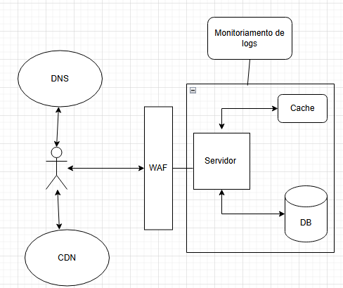

# Book Data API

Este projeto é uma API desenvolvida com Spring Boot que integra Redis, PostgreSQL, e utiliza práticas como validação de dados, geração de documentação OpenAPI.

## Razões dos usos das tecnologias
 * Foi usado Redis para aliviar a carga no banco de dados.
 * Foi usado um banco relacional pois os dados são estruturados.

## Funcionalidade

A API expõe os seguintes endpoints:

### **1. Buscar todos os livros com resposta paginada**
**GET /books**
#### **Parâmetros de consulta (query params)**
| Parâmetro    | Tipo   | Obrigatório | Padrão | Mínimo | Máximo | Descrição |
|-------------|--------|-------------|---------|--------|--------|------------|
| `page`      | int    | Não         | 0       | 0      | -      | Número da página (baseado em zero) |
| `size`      | int    | Não         | 10      | 1      | 100    | Quantidade de itens por página |

#### **Exemplo de requisição**
```http GET /books?page=1&size=5```

### **Exemplo de resposta (200 OK)**
```json
{
    "content": [
        {
            "id": 1,
            "title": "Arms and the Man",
            "author": "Darcy Bailey",
            "genre": "Science fiction"
        }
    ],
    "totalPages": 200,
    "totalElements": 200,
    "last": false,
    "first": true,
    "size": 1,
    "number": 0,
    "numberOfElements": 1,
    "empty": false
}
```


---


### **2. Buscar um livro pelo id**
**GET /books/{id}**

#### **Exemplo de requisição**
```http GET /books/1```

### **Exemplo de resposta (200 OK)**
```json
{
  "id": 1,
  "title": "Arms and the Man",
  "author": "Darcy Bailey",
  "genre": "Science fiction",
  "description": "Quae et omnis et minima qui. Reiciendis nobis tempora earum numquam voluptatem modi debitis. Quae aut ad. Ab similique ullam eligendi ad."
}
```
### **Exemplo de resposta (404 NotFound)**
```json 
{
    "status": 404,
    "msg": "Book id: 1000 not found",
    "timeStamp": 1743259831629
}
```
---

### **3. Buscar um livro pelo gênero com resposta paginada**
**GET /books/genre/{genre}**

#### **Parâmetros de consulta (query params)**
| Parâmetro    | Tipo   | Obrigatório | Padrão | Mínimo | Máximo | Descrição |
|-------------|--------|-------------|---------|--------|--------|------------|
| `page`      | int    | Não         | 0       | 0      | -      | Número da página (baseado em zero) |
| `size`      | int    | Não         | 10      | 1      | 100    | Quantidade de itens por página |

#### **Exemplo de requisição**
```http GET /books/genre/Science fiction?page=0&size=2```


### **Exemplo de resposta (200 OK)**
```json
{
  "content": [
    {
      "id": 1,
      "title": "Arms and the Man",
      "author": "Darcy Bailey",
      "genre": "Science fiction"
    },
    {
      "id": 92,
      "title": "Taming a Sea Horse",
      "author": "Mr. George Towne",
      "genre": "Science fiction"
    }
  ],
  "totalPages": 3,
  "totalElements": 6,
  "last": false,
  "first": true,
  "size": 2,
  "number": 0,
  "numberOfElements": 2,
  "empty": false
}
```

---

### **3. Buscar um livro pelo autor com resposta paginada**
**GET /books/author/{author}**

#### **Parâmetros de consulta (query params)**
| Parâmetro    | Tipo   | Obrigatório | Padrão | Mínimo | Máximo | Descrição |
|-------------|--------|-------------|---------|--------|--------|------------|
| `page`      | int    | Não         | 0       | 0      | -      | Número da página (baseado em zero) |
| `size`      | int    | Não         | 10      | 1      | 100    | Quantidade de itens por página |


#### **Exemplo de requisição**
```http GET /books/author/Darcy Bailey?page=0&size=1```


### **Exemplo de resposta (200 OK)**
```json
{
  "content": [
    {
      "id": 1,
      "title": "Arms and the Man",
      "author": "Darcy Bailey",
      "genre": "Science fiction"
    }
  ],
  "totalPages": 1,
  "totalElements": 1,
  "last": true,
  "first": true,
  "size": 1,
  "number": 0,
  "numberOfElements": 1,
  "empty": false
}
```

---


### **3. Buscar os 10 ultimos livros recentemente vistos**
**GET /books/recently-viewed**


#### **Exemplo de requisição**
```http GET /books/recently-viewed```


### **Exemplo de resposta (200 OK)**
```json
[
  {
    "id": 1,
    "title": "Arms and the Man",
    "author": "Darcy Bailey",
    "genre": "Science fiction",
    "description": "Quae et omnis et minima qui. Reiciendis nobis tempora earum numquam voluptatem modi debitis. Quae aut ad. Ab similique ullam eligendi ad."
  }
]
```
---

## Como usar

### Requisitos

- [JDK 11 ou superior](https://adoptium.net/).
- [Docker](https://docs.docker.com/get-docker/) e [Docker Compose](https://docs.docker.com/compose/)
- [GIT](https://git-scm.com) (se for para clonar o projeto) ou baixar o zip.

### Rodando o projeto

1. Clone o repositório:
```bash
git clone https://github.com/RaafaRodrigues/bookdata.git
```


2. Navegue até o diretório do projeto:

```bash
cd bookdata
```

3. Suba os containers Docker:

```bash
docker-compose up -d
```

Isso iniciará a aplicação em segundo plano na porta 8080.

---

### Documentação da API

A documentação da API é gerada automaticamente usando o Swagger e pode ser acessada em:

[http://localhost:8080/swagger-ui.html](http://localhost:8080/swagger-ui.html)


---
## Padrões usados no código

### 1 - Facade
 * Usado para simplificar a camada entre a controller e service.

### 2 - Observer
 * Usado para os visualizados recentemente.

### 3 - Repository e Service pattern
 * Usado para gerar desacoplar o codigo e não depender de implementações concretas.

---

## System design

### 1 - Para uma aplicação com alta demanda.


### 2 - Para uma aplicação com baixa demanda


---
## Ferramentas usadas para auxilio de qualidade e codigo
* Sonar.
* Adicionado configurações para coverage de codigo utilizando o jacoco.
* Adicionado spotless para formatação e validação do codigo.
---

---
## Diagrama do banco de dados

---

---
## Monitoria basica
* Usado Spring Boot Actuator
---

## Melhorias e considerações finais

### Melhorias
* Adicionar autenticação e registros de usuarios.
* Adicionar um novo endpoint de livros mais vistos.
* Mudar do java faker para uma implementação verdadeira de livros.
* Adicionar versionamento de banco de dados usando flyway
---

## Referências

Para mais detalhes, consulte as seguintes documentações:

- [Documentação oficial do Gradle](https://docs.gradle.org)
- [Spring Boot Gradle Plugin Reference Guide](https://docs.spring.io/spring-boot/3.4.4/gradle-plugin)
- [Spring Boot DevTools](https://docs.spring.io/spring-boot/3.4.4/reference/using/devtools.html)
- [Spring Web](https://docs.spring.io/spring-boot/3.4.4/reference/web/servlet.html)
- [Spring Data Redis (Acesso+Driver)](https://docs.spring.io/spring-boot/3.4.4/reference/data/nosql.html#data.nosql.redis)
- [Spring Boot Testing](https://docs.spring.io/spring-boot/docs/3.4.4/reference/html/features.html#features.testing)
- [Spring Boot Actuator](https://docs.spring.io/spring-boot/reference/actuator/index.html)
## Guias

Os seguintes guias ilustram como usar algumas funcionalidades:

- [Construindo um Serviço Web RESTful](https://spring.io/guides/gs/rest-service/)
- [Servindo Conteúdo Web com Spring MVC](https://spring.io/guides/gs/serving-web-content/)
- [Construindo Serviços REST com Spring](https://spring.io/guides/tutorials/rest/)
- [Mensagens com Redis](https://spring.io/guides/gs/messaging-redis/)